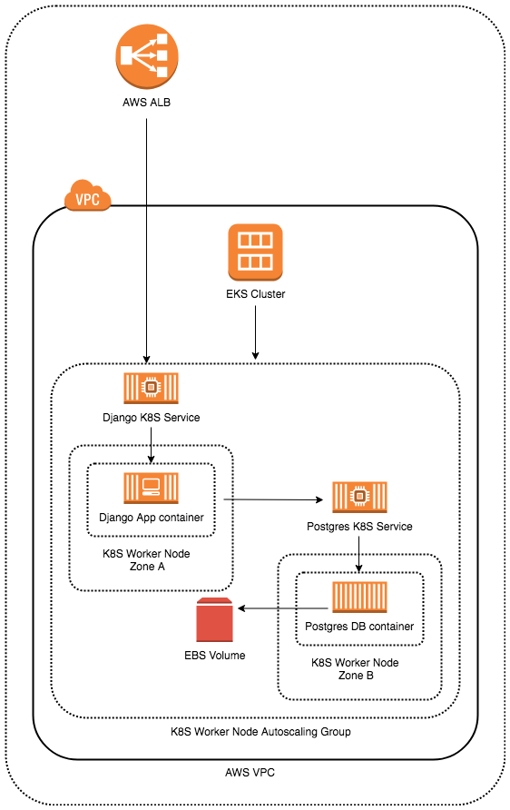

# rv-challenge



## Base infrastructure deployment

The infrastructure is being deployed on AWS. To run the below infrastructure, IAM permissions are needed for atleast IAM, EC2, VPC and EKS. Also the "aws-iam-authenticator" and the "kubectl" binaries are required in the PATH

From the directory "terraform", run

```
$ terraform apply -auto-approve
```

What this does

* Creates a VPC
* Creates two public and two private subnets (along with route tables, gateways, etc) across multiple availability zones
* Creates two security groups and IAM permissions for the EKS cluster and the worker nodes
* Creates a EKS cluster spanning multiple availability zones
* Creates an Autoscaling group for worker nodes across multiple availability zones

After the above command completes run the following scripts from the "terraform" directory

```
$ bash kube-general-conf.sh
```

What this does

* Sets the Kubernetes environment to run "kubectl" command
* The default EKS gp2 storage class does not have a lot of options such as dynamic volume provisioning for cross zone deployment and volume expansion. The script deletes the default class and adds a new one with required parameters and sets it as default

```
$ bash aws-auth.sh
```

What this does

* Adds the required roles for worker nodes to be accepted in the EKS cluster

```
$ bash alb-ing.sh (read the below lines before running this)
```

What this does

* Adds the RBAC roles for deploying the ALB ingress controller 
* Deploys the ALB ingress controller
* In the file "terraform/alb_ing.tf", for the "albingcontroller" local, the values for AWS_ACCESS_KEY_ID and AWS_SECRET_ACCESS_KEY needs to be set for the controller to be able to deploy load balancers. This can be avoided by running the commands from an instance with instance profile having the correct permissions

## The helloapp application

* Repository : https://github.com/sahaanirbantech/helloapp
* Framework : Django
* Python : 3.6
* Database : Postgres

To run locally, set the following environment variables,

```
$ export POSTGRES_DB=helloworld
$ export POSTGRES_USER=hellouser
$ export POSTGRES_PASSWORD=h3110w0r1d
$ export POSTGRES_HOST=postgres
```

To run tests,

```
$ python3 manage.py test
```

To run app locally,

```
$ python3 manage.py runserver
```

Endpoints

* /health-check : For AWS load balancers
* /hello/USERNAME : For GET and POST

## Deploying on Kubernetes

Run the following commands in sequence from the "kubernetes" directory

```
$ kubectl apply -f namespace.yaml
$ kubectl apply -f postgres.yaml
$ kubectl apply -f migration.yaml (only after postgres pod is up and running)
$ kubectl apply -f helloapp.yaml
```

In the "terraform" directory run 

```
$ terraform output public_subnet_ids
```

In the alb.yaml file of the "kubernetes" directory, the value of "alb.ingress.kubernetes.io/subnets" needs to be replaced with the output of the above terraform command

```
$ kubectl apply -f alb.yaml
```

## API examples

PUT call with non-letter characters

```
$ curl -X PUT -H "Content-Type: application/json" -d '{"dateOfBirth":"1967-09-28"}' http://baa800df-helloworld-helloa-c2ab-1551517451.eu-west-1.elb.amazonaws.com/hello/usaha569
{"message":"The provided username is invalid, only letters are accepted!"}
```

PUT call with date in future

```
$ curl -X PUT -H "Content-Type: application/json" -d '{"dateOfBirth":"2020-04-10"}' http://baa800df-helloworld-helloa-c2ab-1551517451.eu-west-1.elb.amazonaws.com/hello/asaha
{"message":"The date of birth entered is in the future"}
```

PUT call with birthday before present day

```
$ curl -X PUT -H "Content-Type: application/json" -d '{"dateOfBirth":"1988-04-10"}' http://baa800df-helloworld-helloa-c2ab-1551517451.eu-west-1.elb.amazonaws.com/hello/asaha
```

PUT call with birthday after present day

```
$ curl -X PUT -H "Content-Type: application/json" -d '{"dateOfBirth":"1955-11-27"}' http://baa800df-helloworld-helloa-c2ab-1551517451.eu-west-1.elb.amazonaws.com/hello/csaha
```

GET call with birthday after present day

```
$ curl -X GET -H "Content-Type: application/json" http://baa800df-helloworld-helloa-c2ab-1551517451.eu-west-1.elb.amazonaws.com/hello/csaha
{"message":"Hello csaha ! Your birthday is in 202 day(s)"}
```

GET call with birthday before present day

```
$ curl -X GET -H "Content-Type: application/json" http://baa800df-helloworld-helloa-c2ab-1551517451.eu-west-1.elb.amazonaws.com/hello/asaha
{"message":"Hello asaha ! Your birthday is in 337 day(s)"}
```

PUT call with birthday on present day

```
$ curl -X PUT -H "Content-Type: application/json" -d '{"dateOfBirth":"1980-05-09"}' http://baa800df-helloworld-helloa-c2ab-1551517451.eu-west-1.elb.amazonaws.com/hello/anona
```

GET call with birthday on present day

```
$ curl -X GET -H "Content-Type: application/json" http://baa800df-helloworld-helloa-c2ab-1551517451.eu-west-1.elb.amazonaws.com/hello/anona
{"message":"Hello anona ! Happy birthday !"}
```
